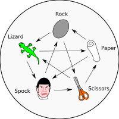

# RPSLS

Rock-Paper-Scissors-Lizard-Spock is game based on principles of Rock-Paper-Scissors
with [Sam Kaas and Karen Bryla extension](http://www.samkass.com/theories/RPSSL.html).

This is Java game adaptation of **RPS Online**, ICQ5 game from 2000s but with
two additional items - Lizard and Spock.

Network game for two players is supported. Currently no AI is available.

## Description
Your main goal is to capture the opponents flag.
You start game with with 12 persons on 6x6 board.
At first, you select position of your flag - you give it to one of your person.
Then you select a trap person - these will kill your opponents person
when touched. Remember - flag and trap person cannot move.
After this point, weapons are assigned to other persons.
If you think weapon distribution is inproper, you can shuffle them again.
When you are ready, then the game begins.
You move your persons on the game board and try to get to opponent flag.
If you encounter opponent person, you attack it and then fight begins
based on your weapons (See Weapon rules below).
If you have got the same weapon as opponents person,
you need to select weapon again, then fight continues until there's a winner.

## Weapon rules
- `ROCK` crushes `SCISSORS`
- `ROCK` crushes `LIZARD`
- `PAPER` covers `ROCK`
- `PAPER` disproves `SPOCK`
- `SCISSORS` cuts `PAPER`
- `SCISSORS` decapitates `LIZARD`
- `LIZARD` eats `PAPER`
- `LIZARD` poisons `SPOCK`
- `SPOCK` vaporizes `ROCK`
- `SPOCK` smashes `SCISSORS`

## Author
Author is Jindra Petřík aka JPEXS

## Sound effects
Game uses sound effects from freesound.org library,
for complete list, see [sound/SOUNDS.md](sound/SOUNDS.md).

## License
Game is licensed under GNU/GPL version 3.

## Changelog
All changes between version are documented in the file [CHANGELOG.md](CHANGELOG.md)
